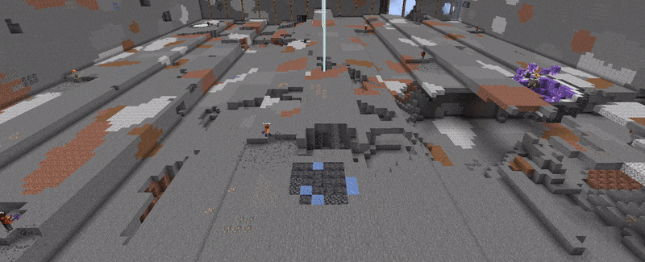

<p align="center" style="margin-bottom: 0px !important;">
    <picture>
        <source media="(prefers-color-scheme: dark)" srcset="Visuals/logo_white.svg">
        <source media="(prefers-color-scheme: light)" srcset="Visuals/logo.svg">
        
    </picture>
</p>
<h1 align="center" style="margin-top: 0px;">Botcraft</h1>

<p align="center">A Minecraft bots library</p>

<div align="center">
    
    <a href="https://discord.gg/wECVsTbjA9" target="_blank"></a>
    <a href="https://adepierre.github.io/Botcraft/" target="_blank"></a>
</div>

<p align="center" style="margin-bottom: 0px !important;">
  
</p>

This is a "learn-by-doing" pet project I develop on my free time when I feel like it. I share the code for people that might be interested but it's more a "shared private repo" than a real open source community project. I usually try to push updates on master every first week of each month, and as soon as they are ready for new Minecraft version support updates.

Precompiled binaries of the library and examples can be found in the [latest release](https://github.com/adepierre/Botcraft/releases/tag/latest) for both Windows and Linux. To compile it yourself, you can check the [Building](#building-and-testing) section.

## Content

  * [Features](#features)
  * [Dependencies](#dependencies)
  * [Building and testing](#building-and-testing)
  * [Examples](#examples)
  * [ProtocolCraft](#protocolcraft)
  * [Clients](#clients)
  * [Connection](#connection)
  * [Mod support](#mod-support)
  * [License](#license)

## Features

Main features are listed below. To see the evolution of the project, check the [changelog](https://github.com/adepierre/Botcraft/wiki/Changelog).

- Connection to minecraft server (both offline "cracked" mode and online connection with ~~Mojang or~~ Microsoft account)
- DNS server name resolution with and without SRV record
- All official releases from 1.12.2 to 1.21.6 supported
- Compression
- Signed chat system for 1.19+ versions
- Vanilla physics and collisions ([wiki page](https://github.com/adepierre/Botcraft/wiki/Physics) for details)
- World data
- Full entity support (type, data, metadata and attributes)
- (Optional) Rendering of all the blocks (including entity-blocks like chests, banners...) and entities (bounding box only)
- Bot programming with a behaviour tree system ([wiki page](https://github.com/adepierre/Botcraft/wiki/Behaviour-system) for details)
- Extremely resource efficient (CPU/RAM) bots (<5 Mb for AFK bots, <60 Mb for other bots in headless mode)
- Bot control with mouse and keyboard
- Custom framework to easily test the bot behaviours on a vanilla server ([wiki page](https://github.com/adepierre/Botcraft/wiki/Test-framework) for details)

Available bot behaviours includes:
- Pathfinding (including ladder/scaffolding climbing, see [wiki page](https://github.com/adepierre/Botcraft/wiki/Pathfinding))
- Block breaking (including with correct tool/haste effects)
- Inventory managing (including interactions with chest/anvil/brewing stand...)
- Block placing (vanilla or mid-air)
- Entity interactions
- Item use (fishing rods, food eating...)
- Block interaction (button, lever, bed...)
- Villager trading (only for versions 1.14+)
- Crafting

### Not supported

- Anti-cheat evasion: Botcraft actions/movements are most of the time vanilla-like, but not human-like. Only use Botcraft on your own servers or ask permission first if you don't want your account to be banned.
- Modded servers: Botcraft aims to be compatible with vanilla server first. When possible, modded servers are also (partially) supported, but given the large diversity of servers and mods, Botcraft does not aim to work on every possible server/mod combination. See [mod support](#mod-support) section for details.
- Rendering and UI may not work on macOS due to platform incompatibility. Everything can run fine even with GUI enable, but macOS will not display the rendering window, making it pointless. I recommend using ``BOTCRAFT_USE_OPENGL_GUI=OFF`` on macOS.

### Nice gifs

Example with 10 survival bots collaborating on a pixel art build. They are all in survival, so they have to pick the right blocks in the chests, eat food and obviously can't fly. There is no global supervision, and they can't communicate with each other.


Complex pathfinding example. The bot has to climb through various blocks as well as fall in water or vines.


Integrated behaviour explorer UI. It supports navigation (translation, zoom, subtree hiding), current and previous nodes status indicator, breakpoints and step by step mode for easy debugging. For more details, see the [behaviour system wiki page](https://github.com/adepierre/Botcraft/wiki/Behaviour-system).


Other gifs/videos can be found in the [Visuals](Visuals/) folder.

## Dependencies

The code is cross-platform and requires a C++17 compiler, as well as git and CMake. I try to keep the number of external libraries for the core part of the library very low (currently only one is mandatory, plus two optionals for additional features). This is less true for the rendering part or testing.
Dependencies are included either directly(\*) or as git submodules(†). All libraries marked as optional are automatically enabled/disabled based on cmake options.

You *don't* have to clone recursively, download nor install any of them: the cmake build system is made to do that for you automatically for each dependency that is not already found on your system. The only exceptions are Java, to launch the test server if enabled, and doxygen to generate the doc. They need to be installed on your system manually.

- [asio](https://think-async.com/Asio/)† for low-level TCP

Optional dependencies (additional features support):
- [openssl](https://www.openssl.org/)† for encryption
- [zlib](https://github.com/madler/zlib)† for compression

Optional dependencies (rendering):
- [glad](https://glad.dav1d.de/)\* for OpenGL stuff
- [glfw](https://github.com/glfw/glfw)† for OpenGL window creation
- [glm](https://github.com/g-truc/glm)† for math stuff
- [imgui](https://github.com/ocornut/imgui)† with [node-editor](https://github.com/thedmd/imgui-node-editor)† extension for additional UI display
- [rectpack2D](https://github.com/TeamHypersomnia/rectpack2D)† for texture packing
- [stb_image](https://github.com/nothings/stb)\* for texture loading and screenshot saving

Optional dependencies (testing)
- [catch2](https://github.com/catchorg/Catch2)† for tests management
- [subprocess.h](https://github.com/sheredom/subprocess.h)\* to launch the vanilla test server
- [Java](https://www.java.com/) 8 for Minecraft < 1.17, 17 for Minecraft < 1.20.5, 21 for Minecraft 1.20.5+ to run the vanilla test server

Optional dependencies (doc generation)
- [doxygen](https://www.doxygen.nl/) for documentation generation
- [doxygen-awesome-css](https://github.com/jothepro/doxygen-awesome-css)\* for documentation layout


## Building and testing

To build the library yourself, with both encryption and compression support, but without OpenGL rendering support:
```bash
git clone https://github.com/adepierre/Botcraft.git
cd Botcraft
mkdir build
cd build
cmake -DBOTCRAFT_GAME_VERSION=latest -DCMAKE_BUILD_TYPE=Release -DBOTCRAFT_BUILD_EXAMPLES=ON -DBOTCRAFT_BUILD_TESTS=ON -DBOTCRAFT_BUILD_TESTS_ONLINE=ON -DBOTCRAFT_COMPRESSION=ON -DBOTCRAFT_ENCRYPTION=ON -DBOTCRAFT_USE_OPENGL_GUI=OFF ..
cmake --build . --config Release
# Run all tests (optional)
ctest -C Release
# Build doc (optional)
cmake --build . --target doc_doxygen
```

At this point, you should have all the examples compiled and ready to run, the tests performed and the documentation generated. Please note that you don't have to clone recursively or download and install the dependencies manually, cmake will automatically take care of these steps based on your build configuration and what is already installed on your machine. On Windows with Visual, you can also use cmake-gui and then compile the .sln directly from Visual. For a detailed Windows building tutorial, see this [wiki](https://github.com/adepierre/Botcraft/wiki/Detailed-from-source-installation-guide) page.

You can check [this discussion](https://github.com/adepierre/Botcraft/discussions/45#discussioncomment-1142555) for an example of how to use botcraft with your own code. In case you need help, you can try to ask on the [community discord server](https://discord.gg/wECVsTbjA9).

There are several cmake options you can modify:
- BOTCRAFT_GAME_VERSION [1.XX.X or latest]
- BOTCRAFT_BUILD_EXAMPLES [ON/OFF]
- BOTCRAFT_BUILD_TESTS [ON/OFF]
- BOTCRAFT_BUILD_TESTS_ONLINE [ON/OFF] To build additional tests. Requires BOTCRAFT_COMPRESSION and java to launch a local vanilla server.
- BOTCRAFT_OUTPUT_DIR [PATH] Base output build path. Binaries, assets and libs will be created in subfolders of this path (default: top project dir)
- BOTCRAFT_COMPRESSION [ON/OFF] Add compression ability, must be ON to connect to a server with compression enabled
- BOTCRAFT_ENCRYPTION [ON/OFF] Add encryption ability, must be ON to connect to a server in online mode
- BOTCRAFT_USE_OPENGL_GUI [ON/OFF] If ON, botcraft will be compiled with the OpenGL GUI enabled
- BOTCRAFT_USE_IMGUI [ON/OFF] If ON, additional information will be displayed on the GUI (need BOTCRAFT_USE_OPENGL_GUI to be ON)
- BOTCRAFT_WINDOWS_BETTER_SLEEP [ON/OFF] If ON, thread sleep durations will be more accurate (only for Windows 10/11, no effect on other OS)
- BOTCRAFT_USE_PRECOMPILED_HEADERS [ON/OFF] If ON, will use precompiled headers to speed up compilation process (ignored on GCC as precompiled headers slow down the build process)
- BOTCRAFT_BUILD_DOC [ON/OFF] If ON, a target to generate the documentation will be added

## Examples

Examples can be found in the [Examples](Examples/) folder:
- [0_HelloWorld](Examples/0_HelloWorld): Connect to a server, sends Hello World! in the chat then disconnect
- [1_UserControlledExample](Examples/1_UserControlledExample): Best with GUI enabled. Mouse and keyboard controlled player. Can be used in a dummy offline world (without any server) to test things like physics or rendering and in real servers.
- [2_ChatCommandExample](Examples/2_ChatCommandExample): Simple bot that obeys commands sent through chat. Should work with chat from vanilla and non-vanilla servers (paper, forge ...)
- [3_SimpleAFKExample](Examples/3_SimpleAFKExample): Very lightweight AFK bot. Simply connect to a server and stay still doing nothing.
- [4_MapCreatorExample](Examples/4_MapCreatorExample): Much more complex example, with autonomous behaviour implemented to build a map based pixel art. Can be launched with multiple bot simultaneously. They can share their internal representation of the world to save some RAM, at the cost of slowing down if too many share the same (due to concurrent access). Only extensively tested on 1.16.5, but should work with minor to none adaptation on previous/older versions.
- [5_MobHitterExample](Examples/5_MobHitterExample): Entity processing example. Attack every monster in range, with a per-entity cooldown of 0.5s. /!\ This is only an example about entities, no eating is performed, so would starve to death pretty quickly if used as-is.
- [6_DispenserFarmExample](Examples/6_DispenserFarmExample): A full example with a real usecase in mind. Fully autonomous dispenser farm. More detailed explanations can be found on the associated [wiki page](https://github.com/adepierre/Botcraft/wiki/Dispensers-example).
- [7_WorldEaterExample](Examples/7_WorldEaterExample): A full example with a real usecase in mind. Fully autonomous world eater program. More detailed explanations can be found on the associated [wiki page](https://github.com/adepierre/Botcraft/wiki/World-Eater-example).

## ProtocolCraft

ProtocolCraft is a sublibrary of the botcraft repository. It is a full implementation of the minecraft protocol for all supported versions. It's based on the [official source code mapping](https://www.minecraft.net/en-us/article/minecraft-snapshot-19w36a) provided by Mojang. I try to keep all the packets and variable names as close as possible to the source code ones. To avoid name conflicts, an underscore is sometimes appended at the end of a variable name.

## Clients

Botcraft has multiple ``XXXClient`` classes you can inherit from depending on what you want to achieve. For more details, you can check the corresponding [wiki page](https://github.com/adepierre/Botcraft/wiki/Clients).

## Connection

Botcraft supports both servers in offline ("cracked") and online mode. If the server is in online mode, a valid Microsoft account (Mojang accounts are not valid anymore) owning the game is required. Detailed information about how to connect with offline or Microsoft accounts can be found in the [wiki page](https://github.com/adepierre/Botcraft/wiki/Connection).

## Mod support

Botcraft is developped and tested to be compatible with vanilla servers. It might be able to connect to other servers (e.g. Fabric) if there is no mods or server only mods (e.g. performance mods). However, as soon as a mod needs to communicate with the client, or interfere with the vanilla protocol (e.g. no chat report), things might get tricky. All packets related to this mod will come and go through on a dedicated "registered channel", and ProtocolCraft will only expose them as raw byte arrays. You will have to implement a custom parsing/serialization code. For more details on how to do that, see the dedicated [wiki page](https://github.com/adepierre/Botcraft/wiki/Mod-support).

## License

GPL v3 (if you wonder why, see [this discussion](https://github.com/adepierre/Botcraft/discussions/51)).
