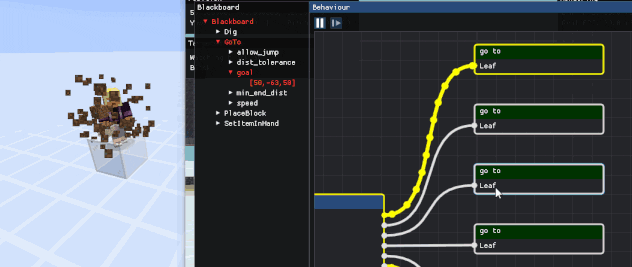

[](https://discord.gg/wECVsTbjA9)
[]()

# Botcraft

Botcraft is a cross-platform C++ library to connect and interact with Minecraft servers with (optional) integrated OpenGL renderer.

This is a "learn-by-doing" code, with some lines dating back to 2017 and never changed since. A lot of things should be improved or refactored. I only code this on my free time, when I feel like it, so don't expect it to be a fully-featured commercial grade library. I share the code because I think it can be interesting for other people, but the goal is not to make it a widely adopted library, or even a useful one. I just do it for fun, it's more a shared private repo than a real team open source project. If you're looking for more features, there are alternative libraries by people with much more time (and probably talent) than myself.

Precompiled binaries for the latest game version can be found in the [latest release](https://github.com/adepierre/Botcraft/releases/tag/latest) for both Windows and Linux. To compile it yourself, you can check the [Building](#building-and-testing) section.

## Content

  * [Features](#features)
  * [Dependencies](#dependencies)
  * [Building and testing](#building-and-testing)
  * [Examples](#examples)
  * [ProtocolCraft](#protocolcraft)
  * [Clients](#clients)
  * [Connection](#connection)
  * [License](#license)

## Features

Main features are listed below. To see the evolution of the project, check the [changelog](https://github.com/adepierre/Botcraft/wiki/Changelog).

- Connection to minecraft server (both offline "cracked" mode and online connection with ~~Mojang or~~ Microsoft account)
- DNS server name resolution with and without SRV record
- All official releases from 1.12.2 to 1.19.4 supported
- Compression
- Signed chat system for 1.19+ versions
- Physics and collisions
- World data
- Full entity support (type, data and metadata)
- (Optional) Rendering of all the blocks (including entity-blocks like chests, banners...) and entities (bounding box only)
- Bot programming with a behaviour tree system ([wiki page](https://github.com/adepierre/Botcraft/wiki/Behaviour-system) for details)
- extremely resource efficient (CPU/RAM) AFK bots
- Bot control with mouse and keyboard
- Custom framework to easily test the bot behaviours on a vanilla server ([wiki page](https://github.com/adepierre/Botcraft/wiki/Test-framework) for details)

Available bot behaviours includes:
- Path finding (including ladder/scaffholding climbing)
- Block breaking
- Inventory managing (including with chest)
- Block placing
- Block interaction (button, lever etc...)
- Villager trading (only for versions 1.14+)
- Crafting

### Not supported

- Anti-cheat evasion: Botcraft actions are most of the time vanilla-like, but not human-like. Only use Botcraft on your own servers or ask permission first if you don't want your account to be banned.
- Modded servers: Botcraft aims to be compatible with vanilla server first. When possible, modded servers are also (partially) supported, but given the large diversity of servers and mods, Botcraft does not aim to work on every possible server/mod combination.


### Nice gifs

Example with 10 survival bots collaborating on a pixel art build. They are all in survival, so they have to pick the right blocks in the chests, eat food and obviously can't fly. There is no global supervision, and they can't communicate with each other.


Complex pathfinding example. The bot has to climb through various blocks as well as fall in water or vines.


Integrated behaviour explorer UI. It supports navigation (translation, zoom, subtree hiding), current and previous nodes status indicator, breakpoints and step by step mode for easy debugging. For more details, see the [behaviour system wiki page](https://github.com/adepierre/Botcraft/wiki/Behaviour-system).



Other gifs/videos can be found in the [Visuals](Visuals/) folder.

## Dependencies

The code is cross-platform and requires a C++17 compiler, as well as git and CMake. I try to keep the number of external libraries for the core part of the library very low. This is less true for the rendering part or testing.
Dependencies are included either directly(\*) or as git submodules(†). All libraries marked as optional can be disabled using cmake options.

You *don't* have to clone recursively, download nor install any of them: the cmake build system is made to do that for you automatically for each dependency that is not already found on your system. The only exceptions are Java to launch the test server if enabled and doxygen to generate the doc.

- [asio](https://think-async.com/Asio/)† for low-level TCP

Optional dependencies (additional features support):
- [openssl](https://www.openssl.org/)† for encryption
- [zlib](https://github.com/madler/zlib)† for compression

Optional dependencies (rendering):
- [glad](https://glad.dav1d.de/)\* for OpenGL stuff
- [glfw](https://github.com/glfw/glfw)† for OpenGL window creation
- [glm](https://github.com/g-truc/glm)† for math stuff
- [imgui](https://github.com/ocornut/imgui)† with [node-editor](https://github.com/thedmd/imgui-node-editor)† extension for additional UI display
- [rectpack2D](https://github.com/TeamHypersomnia/rectpack2D)† for texture packing
- [stb_image](https://github.com/nothings/stb)\* for texture loading and screenshot saving

Optional dependencies (testing)
- [catch2](https://github.com/catchorg/Catch2)† for tests management
- [subprocess.h](https://github.com/sheredom/subprocess.h)\* to launch the vanilla test server
- [Java](https://www.java.com/) 8 for Minecraft < 1.17, 17 for Minecraft 1.17+ to run the vanilla test server

Optional dependencies (doc generation)
- [doxygen](https://www.doxygen.nl/) for documentation generation
- [doxygen-awesome-css](https://github.com/jothepro/doxygen-awesome-css)\* for documentation layout


## Building and testing

To build the library yourself, with both encryption and compression support, but without OpenGL rendering support:
```
git clone https://github.com/adepierre/Botcraft.git
cd Botcraft
mkdir build
cd build
cmake -DBOTCRAFT_GAME_VERSION=latest -DCMAKE_BUILD_TYPE=Release -DBOTCRAFT_BUILD_EXAMPLES=ON -DBOTCRAFT_BUILD_TESTS=ON -DBOTCRAFT_BUILD_TESTS_ONLINE=ON -DBOTCRAFT_COMPRESSION=ON -DBOTCRAFT_ENCRYPTION=ON -DBOTCRAFT_USE_OPENGL_GUI=OFF ..
cmake --build . --config Release
ctest -C Release
cmake --build . --target doc_doxygen
```

At this point, you should have all the examples compiled and ready to run, the tests performed and the documentation generated. Please note that you don't have to clone recursively or download and install the dependencies manually, cmake will automatically take care of these steps based on your build configuration and what is already installed on your machine. On Windows with Visual, you can also use cmake-gui and then compile the .sln directly from Visual. For a detailed Windows building tutorial, see this [wiki](https://github.com/adepierre/Botcraft/wiki/Detailed-installation-guide) page.

You can check [this discussion](https://github.com/adepierre/Botcraft/discussions/45#discussioncomment-1142555) for an example of how to use botcraft with your own code. In case you need help, you can try to ask on the [community discord server](https://discord.gg/wECVsTbjA9).

There are several cmake options you can modify:
- BOTCRAFT_GAME_VERSION [1.XX.X or latest]
- BOTCRAFT_BUILD_EXAMPLES [ON/OFF]
- BOTCRAFT_BUILD_TESTS [ON/OFF]
- BOTCRAFT_BUILD_TESTS_ONLINE [ON/OFF] To build additional tests. Requires BOTCRAFT_COMPRESSION and java to launch a local vanilla server.
- BOTCRAFT_OUTPUT_DIR [PATH] Base output build path. Binaries, assets and libs will be created in subfolders of this path (default: top project dir)
- BOTCRAFT_COMPRESSION [ON/OFF] Add compression ability, must be ON to connect to a server with compression enabled
- BOTCRAFT_ENCRYPTION [ON/OFF] Add encryption ability, must be ON to connect to a server in online mode
- BOTCRAFT_USE_OPENGL_GUI [ON/OFF] If ON, botcraft will be compiled with the OpenGL GUI enabled
- BOTCRAFT_USE_IMGUI [ON/OFF] If ON, additional information will be displayed on the GUI (need BOTCRAFT_USE_OPENGL_GUI to be ON)
- BOTCRAFT_WINDOWS_BETTER_SLEEP [ON/OFF] If ON, thread sleep durations will be more accurate (only for Windows 10/11, no effect on other OS)
- BOTCRAFT_USE_PRECOMPILED_HEADERS [ON/OFF] If ON, will use precompiled headers to speed up compilation process (ignored on GCC as precompiled headers slow down the build process)
- BOTCRAFT_BUILD_DOC [ON/OFF] If ON, a target to generate the documentation will be added

## Examples

Examples can be found in the [Examples](Examples/) folder:
- [0_HelloWorld](Examples/0_HelloWorld): Connect to a server, sends Hello World! in the chat then disconnect
- [1_UserControlledExample](Examples/1_UserControlledExample): Best with GUI enabled. Mouse and keyboard controlled player. Can be used in a dummy offline world (without any server) to test things like physics or rendering, or in a real server.
- [2_ChatCommandExample](Examples/2_ChatCommandExample): Simple bot that obeys commands sent through vanilla chat. Should work with chat from vanilla and non-vanilla servers (paper, forge ...)
- [3_SimpleAFKExample](Examples/3_SimpleAFKExample): Highly CPU/RAM efficient AFK only bot. Simply connect to a server and stay still doing nothing.
- [4_MapCreatorExample](Examples/4_MapCreatorExample): Much more complex example, with autonomous behaviour implemented to build a map based pixel art. Can be launched with multiple bot simultaneously. They can share their internal representation of the world to save some RAM, at the cost of slowing down if too many share the same (due to concurrent access). Only extensively tested on 1.16.5, but should work with minor to none adaptation on previous/older versions.
- [5_MobHitterExample](Examples/5_MobHitterExample): Entity processing example. Attack every monster in range, with a per-entity cooldown of 0.5s. /!\ This is only an example about entities, no eating is performed, so would starve to death pretty quickly if used as-is.
- [6_DispenserFarmExample](Examples/6_DispenserFarmExample): A full example with a real usecase in mind. Fully autonomous dispenser farm. More detailed explanations can be found on the associated [wiki page](https://github.com/adepierre/Botcraft/wiki/Dispensers-example).

## ProtocolCraft

ProtocolCraft is a sublibrary of the botcraft repository. It is a full implementation of the minecraft protocol for all supported versions. It's based on the [official source code mapping](https://www.minecraft.net/en-us/article/minecraft-snapshot-19w36a) provided by Mojang. I try to keep all the packets and variable names as close as possible to the source code ones. To avoid name conflicts, an underscore is sometimes appended at the end of a variable name.

## Clients

Botcraft has multiple ``XXXClient`` classes you can inherit from depending on what you want to achieve. For more details, you can check the corresponding [wiki page](https://github.com/adepierre/Botcraft/wiki/Clients).

## Connection

Botcraft supports both servers in offline ("cracked") and online mode. If the server is in online mode, a valid Microsoft account (Mojang account are not valid anymore) owning the game is required. Detailed information about how to connect with offline or  Microsoft accounts can be found in the [wiki page](https://github.com/adepierre/Botcraft/wiki/Connection).

## License

GPL v3 (if you wonder why, see [this discussion](https://github.com/adepierre/Botcraft/discussions/51)).
